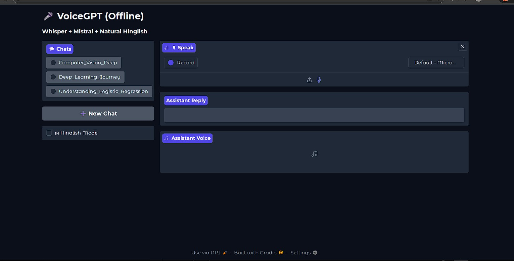

# 🎤 VoiceGPT (Offline)

A fully offline AI Voice Assistant built using **Whisper + Mistral + Hinglish TTS + Gradio**.

This project lets you speak to your computer and get spoken AI replies — completely locally.

**No cloud APIs**  
**No OpenAI keys**  
**No internet required (after models are downloaded)**

---

## 🚀 Features

- ✅ Offline Speech-to-Text using Whisper  
- ✅ Local LLM via Ollama (Mistral)  
- ✅ Hinglish responses (Hindi written in English)  
- ✅ Automatic chat titles  
- ✅ Audio + text responses  
- ✅ Topic-based conversation folders  
- ✅ Gradio UI  
- ✅ CPU friendly  
- ✅ Fully local pipeline  

---

## 🧠 Tech Stack

- Python 3.10+  
- OpenAI Whisper (tiny)  
- Ollama (Mistral)  
- Edge-TTS  
- Gradio  

---

## 📸 Demo Screenshot

### Chat Interface



## 📁 Project Structure

VoiceGPT/
│
├── app.py                # Main Gradio app  
├── llm.py                # Mistral + Hinglish logic  
├── whisper_stt.py        # Whisper transcription  
├── requirements.txt  
├── README.md  
│
└── data/  
    └── conversations/  

---

## ⚙️ Installation

### 1️⃣ Create Conda Environment

```bash
conda create -n voicegpt python=3.10
conda activate voicegpt
```

### 2️⃣ Install Dependencies

```bash
pip install -r requirements.txt
```

### 3️⃣ Install Ollama

Download Ollama:

```text
https://ollama.com
```

Pull Mistral model:

```bash
ollama pull mistral
```

### 4️⃣ Install Edge-TTS

```bash
pip install edge-tts
```

### 5️⃣ Run Application

```bash
python app.py
```

Open in browser:

```text
http://127.0.0.1:7860
```

---

## 🗣 Hinglish Mode

Enable the **Hinglish Mode** checkbox.

The assistant replies in:

**Hindi written using English letters**

Example:

> *Aap kaise ho? Main theek hoon.*

---

## 📂 Conversations

Each chat is automatically saved in:

```bash
data/conversations/
```

Every topic gets its own folder:

```bash
Understanding_AI/
```

**Audio and conversation history are stored locally.**

---

## ⚠️ Important Notes

### Hinglish Voice Limitations

- Edge-TTS uses English phonetics  
- Natural Hinglish pronunciation like ChatGPT cloud voices is **not yet available offline**  
- This is a limitation of current open-source TTS engines  

---

## 🚀 Performance

- Whisper **tiny** model is used for faster CPU inference  
- First run may take extra time while loading models  

---

## 📌 Future Improvements

- Better Hinglish TTS  
- GPU-accelerated Whisper  
- Multilingual support  

---

## 👩‍💻 Author

**Shreya Sidabache**  
AI / ML Engineer
